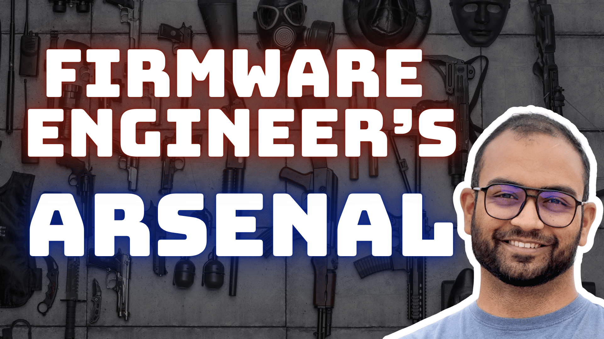

```
The code provided as part of this repository is ONLY for learning purposes!
```

# About

Checkout the Course Bundle: [Firmware Engineer's Arsenal](https://engineers.inpyjama.com/learn/fw-arsenal).



Codespace instance created on this repository is used as Lab environment for the `ARM Cortex-M - Baremetal Assembly Programming` course, included as part of the [Firmware Engineer's Arsenal](https://engineers.inpyjama.com/learn/fw-arsenal) Bundle of courses.

# Resources

Refer to the following resource when progressing through the course:
1. [Cortex-M for Beginners - 2017_EN_v2.pdf](https://community.arm.com/cfs-file/__key/telligent-evolution-components-attachments/01-2057-00-00-00-01-28-35/Cortex_2D00_M-for-Beginners-_2D00_-2017_5F00_EN_5F00_v2.pdf)
2. [Arm_Cortex-M_Processor_Comparison_Table.pdf](https://documentation-service.arm.com/static/655e085f2c8b3557fee7048f?token=)
3. [ARM Architecture Reference Manual Thumb-2 Supplement](https://documentation-service.arm.com/static/661d03b55d66282bc2cf7868?token=)

## Documentation
1. [gnu as](https://ftp.gnu.org/old-gnu/Manuals/gas/html_chapter/as_toc.html)
1. [Cortex-M3 Instructions](https://developer.arm.com/documentation/ddi0337/h/programmers-model/instruction-set-summary/cortex-m3-instructions)

# Copyright
Copyright © 2024 inpyjama.com. All Rights Reserved.
